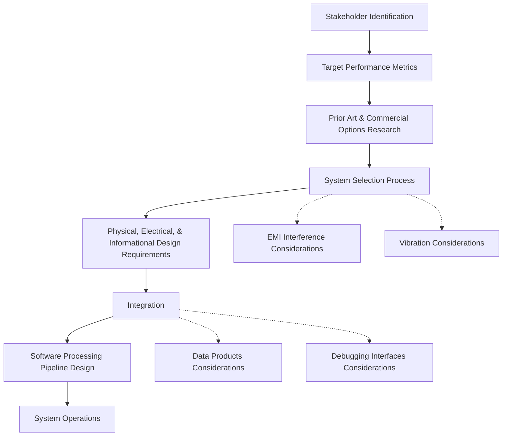

## Explainer Text

### Section 1: Initial Assessment and Research
[[Section 1 Initial Assessment and Research]]
- Stakeholder Identification: Discuss the process of identifying relevant stakeholders who will be involved in the integration process or will be affected by it.
- Target Performance Metrics: Explain how to find and establish key performance metrics for the drone payload system.
- Prior Art and Commercial Options Research: Describe the process of researching existing technologies, patents, and commercial options that might inform the integration process.

### Section 2: System Design and Selection
[[Section 2 System Design and Selection]]
- System Selection Process: Detail the process for choosing components and systems based on requirements, research, and constraints.
- EMI Interference Considerations: Highlight potential electromagnetic interference issues and how they could affect system selection.
- Vibration Considerations: Address vibration issues that may arise and their impact on system selection.
- Physical, Electrical, and Informational Design Requirements: Outline the process for identifying and designing around payload-specific requirements.

### Section 3: Implementation and Operation
[[Section 3 Implementation and Operation]]
- Integration: Walk through the steps for integrating payload components into the drone system.
- Data Products Considerations: Identify what the target data products are and consider how to get to them.
- Debugging Interfaces Considerations: Consider the importance of debugging interfaces when integrating payloads into drones.
- Software Processing Pipeline Design: Explain the process of designing and implementing the software required to process payload data.
- System Operations: Discuss the steps for operating, maintaining, and troubleshooting the integrated drone-payload system, and documenting the payload to an operational state.

