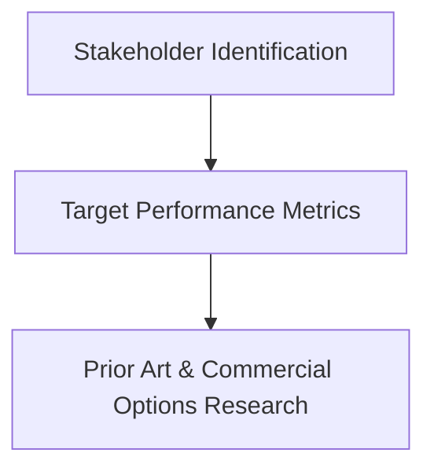

This section involves understanding the context of the integration, including identifying stakeholders, setting performance metrics, and researching existing solutions.

## Stakeholder Identification, Target Performance Metrics, Prior Art and Commercial Options Research

In this section, we focus on the initial steps of integrating payloads into UAVs. We'll first discuss the process of stakeholder identification, which involves recognizing all relevant parties who will participate in or be affected by the integration process. Understanding who these stakeholders are is crucial as it shapes the way we approach the entire process, influencing factors like payload requirements, budgetary considerations, and timelines.

The second topic, target performance metrics, deals with defining and establishing key performance indicators for the drone payload system. These metrics help us to measure the success of our integration efforts and guide the optimization process.

The final part of this section, prior art and commercial options research, involves a thorough investigation of existing technologies, patents, and commercial options. This step ensures we're not duplicating work, infringing on patents, and that we're leveraging available technology where it makes sense.

## Graph

## Stakeholder Table

A stakeholder table is a structured document that identifies and outlines the roles, interests, power or influence, motivations, and contact information of all the parties involved in a project. In the context of a UAV payload integration project, these stakeholders might range from the payload manufacturer to the end-user or client, and regulatory authorities. 

Creating a stakeholder table provides several benefits to the project. Firstly, it encourages the project team to consider all the parties that may affect or be affected by the project, ensuring that no significant parties are overlooked. Secondly, by identifying the role and interest of each stakeholder, the project team can better understand each stakeholder's needs and expectations. This understanding can guide decision-making throughout the project, leading to a better end result. The inclusion of power or influence and motivations further aids in this by helping the team anticipate how stakeholders might respond to various project decisions or outcomes.

Finally, by providing contact information for each stakeholder, the table serves as a useful reference for communication throughout the project. Regular, effective communication with stakeholders is crucial for maintaining alignment, managing expectations, and promptly addressing any issues that arise.

| Stakeholder     | Role/Interest in Project | Influence/Power | Motivations | Example Contact |
|-----------------|--------------------------|-----------------|-------------|-----------------|
| Payload Manufacturer | Provide technical specifications, support | High | Maintain good customer relationships, sell products | John Doe (jdoe@payloadmfg.com) |
| End User/Client | Define requirements, use drone-payload system | High | Achieve specific objectives with drone-payload system | Jane Smith (jsmith@enduser.com) |
| Regulatory Authority | Ensure compliance with relevant regulations | High | Maintain safe, lawful operation of drones | Officer Lee (olee@regulatoryauthority.gov) |
| ... | ... | ... | ... | ... |

## House of Quality diagram

The HoQ diagram is a structured, visual approach to capturing customer desires (what's needed) and correlating them to how the product or system will deliver those needs (how it's achieved). It allows for both quantifiable (hard) metrics, such as weight or speed, and less tangible (soft) metrics like user-friendliness or reliability to be included.

The HoQ consists of several components, including:

1.  **Customer Requirements (the 'Whats')**: Here, you'd list the desires of the stakeholders. This information could be gathered through interviews, surveys, or focus groups with your stakeholders.
    
2.  **Technical Requirements (the 'Hows')**: This is where you translate the 'Whats' into measurable product requirements.
    
3.  **Relationship Matrix**: This part of the HoQ shows the relationship between customer requirements and technical requirements. The strength of each relationship is often rated on a scale (e.g., strong, moderate, weak).
    
4.  **Target Values**: These are the hard performance metrics. Here, you'd set specific, measurable goals for each technical requirement.
    

Soft performance metrics are represented in the Customer Requirements and the Relationship Matrix. For example, a customer might express a need for the drone to be "easy to control". This is a soft metric - it's subjective and difficult to measure directly. However, in the Relationship Matrix, you might correlate "easy to control" with more measurable technical requirements such as "control sensitivity" or "response time", which you can set target values for.

The House of Quality approach is an effective way to ensure all stakeholder desires are taken into account and translated into actionable, measurable requirements. It's particularly useful for managing complex projects like UAV payload integration, where there are many interrelated requirements to balance.

### Simple Example Table

| Customer Requirements | Relationship with Technical Requirements | Technical Requirements | Target Values |
|-----------------------|-----------------------------------------|------------------------|---------------|
| Long Battery Life (soft)     | Strong | Battery Capacity (mAh) | 5000 mAh |
| Stable in High Winds (soft) | Moderate | Wind Resistance (km/h) | 40 km/h |
| High Image Quality (soft)   | Strong | Camera Resolution (MP) | 20 MP |
| ... | ... | ... | ... |

In this simplified table, the 'Customer Requirements' column represents the desires of the stakeholders. The 'Relationship with Technical Requirements' column indicates the relationship strength between these desires and the corresponding technical requirements. The 'Technical Requirements' column specifies the measurable aspects of the drone that will meet customer desires, and the 'Target Values' column sets quantifiable goals for each of these technical requirements.

In a complete HoQ diagram, each customer requirement would be related to every technical requirement, allowing the project team to see the interconnectedness of different aspects of the project. The diagram would also include a section for benchmarking against competitors and prioritizing requirements based on customer importance and technical difficulty. However, this simplified version gives you a basic understanding of the concept.

## Prior Art Document

A Prior Art Document, often referred to as a patent or non-patent literature (NPL), is an integral component of any research or development project. This document represents publicly disclosed information about an invention, technology, method, or process before a specific date. It serves multiple purposes:

1. **Evidence of Existing Technology**: Prior art serves as proof that a particular invention or concept is already known publicly. This evidence can be in various forms, such as patents, patent applications, academic papers, articles, presentations, public demonstrations, or any other public documentation.

2. **Legal Protection**: Prior art research helps ensure that the project does not infringe on existing patents. It's a crucial part of the design process for legal protection and respecting the intellectual property rights of others.

3. **Insight into Solved Problems and New Ideas**: Reviewing prior art can provide insights into existing solutions for problems similar to those the project is attempting to solve. It can also inspire new ideas or improvements to incorporate into the project.

4. **Identifying Commercial Solutions**: Prior art research can identify existing commercial products and solutions. For instance, during a UAV payload integration project, prior art might reveal an off-the-shelf, drone-compatible camera that meets the project's image quality, weight, and power requirements. This insight can guide project decisions such as whether to purchase an existing product or develop a new one.

5. **Cost and Time Efficiency**: If an off-the-shelf solution meets the project requirements, it can save significant time and resources that would have been spent developing a new solution. This efficiency extends to reducing the risk of technical challenges and delays associated with new product development.

Thus, a Prior Art Document serves as an essential tool in the planning and execution of a project. It assists in understanding the current state of technology, respecting intellectual property rights, and informing strategic decisions for the project's success.