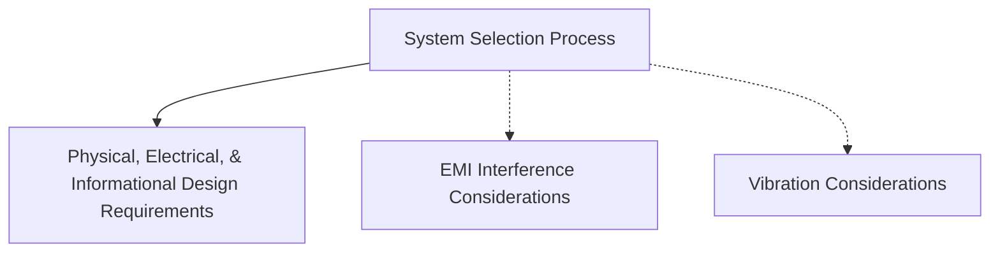

This section focuses on the selection and design of systems, taking into account various considerations such as EMI interference, vibration, and specific design requirements.

## System Selection Process, EMI Interference and Vibration Considerations, Physical, Electrical, and Informational Design Requirements

In section 2, we delve into the specifics of the system selection process. This step is crucial as it involves picking components and systems based on a variety of factors including the needs identified by stakeholders, research findings, and various constraints such as budget or weight limitations.

Next, we will consider potential electromagnetic interference (EMI) issues. Drones operate in environments filled with electromagnetic waves, and the components we choose must not only be resistant to these waves, but also must not generate interference that could hinder the drone's operation.

Vibration considerations are also paramount. UAVs, especially those with rotary wing designs, can generate significant vibrations that can interfere with payload functionality. Therefore, our system selection must account for vibration mitigation strategies.

The final part of this section addresses the physical, electrical, and informational design requirements. These requirements are specific to each payload and must be identified early in the process to guide the design and integration of the payload into the drone.

## Graph

## Figure of Merit Chart
A Figure of Merit (FoM) chart, also known as a decision matrix, Pugh matrix, or trade study, is an analytical tool used in the decision-making process to evaluate and rank multiple options based on specific criteria. It helps streamline the process of choosing the best option based on quantitative metrics. This tool can be particularly useful in the "System Design and Selection" phase of a UAV payload integration project, where there may be multiple solutions that meet the design requirements to varying degrees.

This is a really useful tool to weigh the Physical, Electrical, and Informational Design Requirements of a system.

Here's how you might use a Figure of Merit chart in this context:

1. **List the options**: Each potential solution, or system, is listed as a row in the chart. These might be different models of payload, different types of integration techniques, or different suppliers, depending on what decision you're trying to make.

2. **Define the criteria**: Each design requirement or consideration is listed as a column in the chart. These might be things like cost, weight, power consumption, image resolution (for a camera payload), or robustness to vibrations.

3. **Assign weights**: Each criterion is assigned a weight according to its importance in the decision. This weight is typically determined through discussion and consensus among the project team, considering both the needs of the project and the desires of stakeholders. 

4. **Rate each option**: Each option is then scored on each criterion, usually on a simple numerical scale (like 1-5 or 1-10). This score is based on how well the option meets the criterion, with higher scores indicating better performance.

5. **Calculate the Figure of Merit**: The Figure of Merit for each option is calculated by multiplying each criterion's score by its weight, and then summing these weighted scores. This yields a single, overall score for each option.

6. **Make the decision**: The option with the highest Figure of Merit is typically considered the best choice, as it has the highest overall performance across the weighted criteria.

By quantifying the performance of each option against each criterion, a Figure of Merit chart provides a clear, objective basis for decision-making. It enables the project team to consider multiple factors simultaneously and to balance trade-offs between them. This can be particularly valuable in complex projects like UAV payload integration, where decisions can have multiple technical, logistical, and financial implications.

### Example
| Camera Payload Options | Image Quality (3) | Power Consumption (2) | Weight (2) | Cost (1) | Figure of Merit |
|------------------------|-------------------|-----------------------|------------|-----------|-----------------|
| Camera A               | 8                 | 7                     | 9          | 6         | 62              |
| Camera B               | 9                 | 5                     | 6          | 7         | 56              |
| Camera C               | 7                 | 8                     | 8          | 5         | 58              |
| ... | ... | ... | ... | ... | ... |

In this table, each camera payload is rated on a scale of 1-10 (with 10 being the best) for each criterion: image quality, power consumption, weight, and cost. The numbers in parentheses next to each criterion are the weights assigned to that criterion, reflecting its relative importance in the decision.

The Figure of Merit for each option is calculated by multiplying each score by the weight for that criterion, then summing these weighted scores. So for Camera A, the Figure of Merit is (8\*3) + (7\*2) + (9\*2) + (6\*1) = 62.

Based on these Figures of Merit, Camera C would be the best choice in this scenario, as it has the highest overall performance across the weighted criteria. However, the team might consider other factors, such as the specific needs of the project or the preferences of the stakeholders, before making the final decision.

## Failure Modes and Effect Analysis (FEMA)

FMEA is a proactive, systematic, and structured methodology for evaluating a process, product, or system to identify where and how it might fail. The goal is to assess the impact of different failures in order to prioritize parts of the system that need improvement.

There are three key components to the FMEA process:

1.  **Failure Modes**: These are the ways in which something might fail. Failures are errors or defects, especially ones that affect the customer.
    
2.  **Effects Analysis**: This is the study of the consequences of those failures.
    
3.  **Causes/ Mechanisms of Failure**: These are defects in design, process, or part application, which are the root cause of the failure.
    

Each identified failure mode is assigned a score for Severity, Occurrence, and Detection. The Severity score represents the seriousness of the effect of the failure. The Occurrence score represents the probability of the failure happening, and the Detection score represents the probability of the failure being detected before the customer experiences it. The product of these three scores is the Risk Priority Number (RPN), which can be used to prioritize failures for corrective action.

In essence, FMEA is used to prioritize failures according to their effect on the customer, and identify and eliminate obvious failure modes. It helps engineers and designers to design out failures, and design in reliability and safety. The aim is to reduce the risk of failures and create the most reliable, safe, and customer-satisfying product or process.

### Example
| Failure Mode | Effects | Severity (1-10) | Causes | Occurrence (1-10) | Current Controls | Detection (1-10) | Risk Priority Number (RPN) |
|--------------|---------|-----------------|--------|-------------------|------------------|------------------|---------------------------|
| EMI from USB 3.0 interference with GPS receiver | GPS signal loss, inaccurate positioning | 9 | USB 3.0 cable routing close to GPS receiver | 5 | Shielding on USB and GPS cables, EMI filters on power lines | 4 | 180 |
| Vibration leading to HDD failure | Loss of data storage, interruption in data logging | 8 | Drone motors, wind turbulence, unbalanced propellers | 6 | HDD shock mounts, balancing propellers, use of SSD instead of HDD | 3 | 144 |
| ... | ... | ... | ... | ... | ... | ... | ... |

The Risk Priority Number (RPN) is calculated as the product of Severity, Occurrence, and Detection scores. It provides a measure of risk associated with each failure mode and helps prioritize areas for improvement.

In this table, the failure modes are EMI from USB 3.0 interfering with the GPS receiver and vibration leading to HDD failure. Their effects, causes, and current controls are described, and each is rated on a scale of 1-10 for severity, occurrence, and detection. Based on these ratings, the RPNs are calculated to help prioritize these issues.

This is a simplified version of FMEA, which is typically more detailed and includes additional considerations, such as recommended actions, responsibilities, and deadlines.