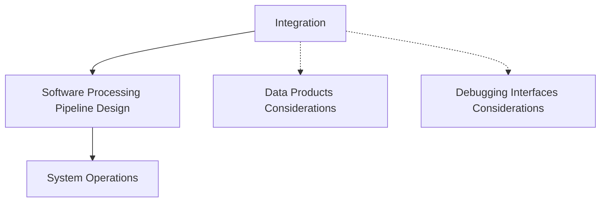
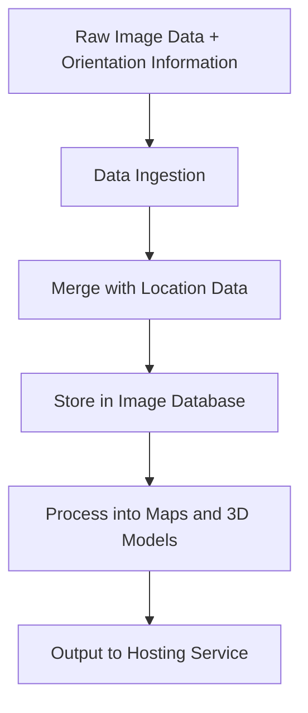

The final section is all about the actual integration process and the operation of the drone with the payload.

## Integration, Data Products and Debugging Interfaces Considerations, Software Processing Pipeline Design, System Operations

Section 3 revolves around the practical aspects of payload integration. We start with the physical integration of payload components into the drone system, ensuring compatibility and functionality.

As we move on, we'll discuss data products considerations. Depending on the purpose of the payload, it will produce specific types of data that must be processed and interpreted. Understanding these data products helps guide the integration process and the design of the data processing software.

Debugging interfaces are another vital consideration. These interfaces are crucial for testing and troubleshooting the payload, and understanding them is essential for successful payload integration.

Next, we delve into software processing pipeline design, which entails developing and implementing the software needed to process the data produced by the payload.

The final topic is system operations, which covers the steps for operating, maintaining, and troubleshooting the integrated drone-payload system. It also addresses the importance of documenting the payload to an operational state, to provide a clear, step-by-step guide for others to use.

## Graph

## Integration of the Camera Payload

The integration of a camera payload into a UAV encompasses a multitude of aspects, ranging from mechanical fittings to the implementation of appropriate software and data processing systems. Here's a look at some of the considerations and steps involved in this process.

### Mechanical Considerations

One of the most fundamental aspects of integration is the physical attachment of the payload to the UAV. This process needs to account for factors such as the size, weight, and balance of the camera. Various attachment mechanisms may be employed, such as dedicated mounting brackets, Velcro straps, or even custom-designed 3D printed parts. The attachment method should ensure that the camera is securely fastened, yet easy to remove for maintenance or upgrades.

It's also important to consider the positioning and orientation of the camera. It must be situated in a way that enables it to capture the desired field of view while avoiding obstructions or interference from the UAV's propellers, body, or other components. Vibrations from the UAV's motors can also impact the camera, so incorporating some form of vibration damping may be beneficial.

### A Holistic Approach to Integration

While the physical attachment of the camera is an essential part of integration, it's just the tip of the iceberg. True integration involves harmonizing the camera payload with all other aspects of the UAV system. Here's a brief overview of some of these considerations:

- **Data Integration**: The data produced by the camera payload must be effectively incorporated into the UAV's data system. This could involve merging image data with location and orientation data from the UAV's GPS and inertial navigation systems, and then storing this combined data in a suitable format for later processing and analysis.

- **Debugging Interfaces**: The camera payload should be integrated with the UAV's debugging interfaces. This might involve providing access points for software debugging or creating mechanisms for error reporting and log retrieval. Such interfaces allow for easier maintenance, troubleshooting, and system improvements.

- **Software Processing Pipeline Design**: An effective software pipeline needs to be designed and implemented to handle the data from the camera payload. This pipeline should cover everything from data ingestion and storage to processing and output, transforming raw image data into valuable, user-friendly data products.

- **Operations Processes**: Integration also involves embedding the operation of the camera payload into the overall UAV operations processes. This could include adding camera-specific items to preflight checklists, developing procedures for camera operation during flight, and incorporating camera maintenance tasks into the UAV's maintenance schedule.

By taking a holistic approach to the integration of a camera payload, you can create a UAV system that is more than just the sum of its parts. The result is a harmonious, efficient, and effective system that fulfills its mission objectives while also being reliable and easy to operate and maintain.

## Data Products and Debugging Interfaces

Data Products and Debugging Interfaces are two crucial considerations when integrating a payload into a UAV. These factors not only determine how the payload will perform but also impact how easily the system can be operated, maintained, and updated.

A 'data product' is essentially the output of the payload. In the context of a camera payload, this might be video or still image files. These files may be processed on-board the UAV (for example, by compressing or encoding them), stored for later download, or transmitted in real time to a ground station.

Debugging interfaces, on the other hand, are tools or access points that allow developers to interact with the system for troubleshooting, maintenance, or upgrades. Depending on the design of the system, debugging might be performed remotely or may require physical access to the UAV.

To illustrate these considerations, let's compare two potential designs for a camera payload: one based on a Linux-style system, and one based on a microcontroller.

| Aspect | Linux System | Microcontroller |
|--------|--------------|-----------------|
| **Data Products** | The camera can generate high-resolution video and still images, which can be processed on-board using powerful, flexible Linux-based software. Data can be stored on a built-in hard drive or solid-state drive, or transmitted to a ground station via a wireless link. | The camera generates lower-resolution video and still images, with limited on-board processing capabilities. Data is stored on an SD card for later download. |
| **Debugging Interfaces** | Developers can connect to the system remotely via SSH, providing a high level of control and flexibility for debugging and maintenance. This eliminates the need for physical access to the UAV, which can be particularly valuable for deployed systems. | Developers must connect to the system directly via a JTAG or serial interface for debugging. This requires physical access to the UAV and provides a lower level of control compared to the Linux system. |
| **Considerations** | Although a Linux system offers many benefits, it also requires more power and computing resources than a microcontroller, and may be more complex to develop and maintain. | While a microcontroller-based system may be simpler and more power-efficient, it also provides less flexibility and capability for data processing and debugging. |

By considering the implications of different data products and debugging interfaces, you can make informed decisions about the design and integration of your UAV payload. This can help ensure that the final system meets the needs of the project, while also being robust, reliable, and easy to operate and maintain.

## Software Processing Pipeline Design

The raw data produced by a UAV payload, such as a camera, typically needs to go through a processing pipeline before it can be visualized and used effectively. This pipeline may include various stages such as data ingestion, data cleaning, merging with auxiliary data, storage, processing, and output.

In the context of a UAV equipped with a camera payload, here's a simplified example of what the processing pipeline might look like:

1. **Raw Image Data + Orientation Information**: This is the initial data produced by the camera payload and the drone's navigation system. It includes both the image data and information about the drone's orientation (pitch, roll, and yaw) at the time each image was captured.

2. **Data Ingestion**: This is the stage where raw data is loaded into the processing pipeline. It might include initial cleaning or formatting steps to ensure the data is in a usable form.

3. **Merge with Location Data**: The image and orientation data is merged with location data from the drone's GPS system. This allows each image to be accurately placed in space, creating a geo-referenced image.

4. **Store in Image Database**: The geo-referenced images are stored in a database. This database serves as the central repository of data for further processing and analysis.

5. **Process into Maps and 3D Models**: The geo-referenced images are processed into maps and 3D models. This might involve techniques like photogrammetry, which uses multiple images to create 3D models, or machine learning algorithms for object detection or classification.

6. **Output to Hosting Service**: The final maps and models are outputted to a hosting service, where they can be accessed and visualized by end-users.

By designing and implementing an effective processing pipeline, you can turn the raw data produced by your drone's camera into valuable, user-friendly visual products. This is a critical part of UAV payload integration and operation.

## System Operations Manual and Preflight Checklist

A System Operations Manual is a comprehensive document that provides detailed guidance on how to operate, maintain, and troubleshoot a specific system—in this case, a UAV with a camera payload. It's an invaluable resource for ensuring safe, efficient, and effective operations, and it's crucial in managing risk and maintaining system longevity. The manual usually covers areas like system startup and shutdown procedures, normal and emergency operations, troubleshooting guides, maintenance procedures, and safety precautions.

For our UAV with a camera payload, a portion of the System Operations Manual would be the Preflight Checklist. This checklist ensures that all necessary steps are taken to prepare the UAV for flight, ensuring safety and readiness. The specific items on the checklist can vary based on the design of the UAV and payload, but here's an example:

#### Preflight Checklist for UAV with Camera Payload

1. **Physical Inspection**: Inspect the UAV and camera for any visible damage. Ensure all components are securely attached. Check the condition of the propellers.
2. **Battery Check**: Ensure that all batteries (UAV and camera) are fully charged and securely installed.
3. **Memory Check**: Verify that the camera’s memory card has enough space for the planned flight.
4. **Camera Settings**: Check that the camera settings (resolution, frame rate, etc.) are appropriate for the mission.
5. **GPS Lock**: Confirm that the UAV has a good GPS lock and the home position is correctly set.
6. **Communication Link**: Verify that the communication link between the UAV and the controller is working correctly.
7. **Sensor Calibration**: Calibrate the UAV’s compass and check other sensor readings (altitude, orientation).
8. **Test Movements**: Carry out small test movements (up, down, rotate).
9. **Payload Test**: If possible, do a quick test of the camera to make sure it's working correctly.
10. **Mission Briefing**: Review the planned flight path and mission objectives. Confirm weather conditions are suitable for flight.

This preflight checklist acts as a guide to ensure all systems are functioning correctly before the UAV takes off, which is essential for a successful mission and for preventing avoidable damage to the UAV.